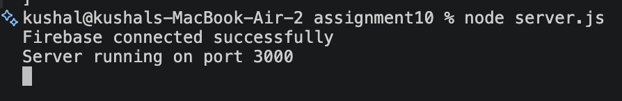
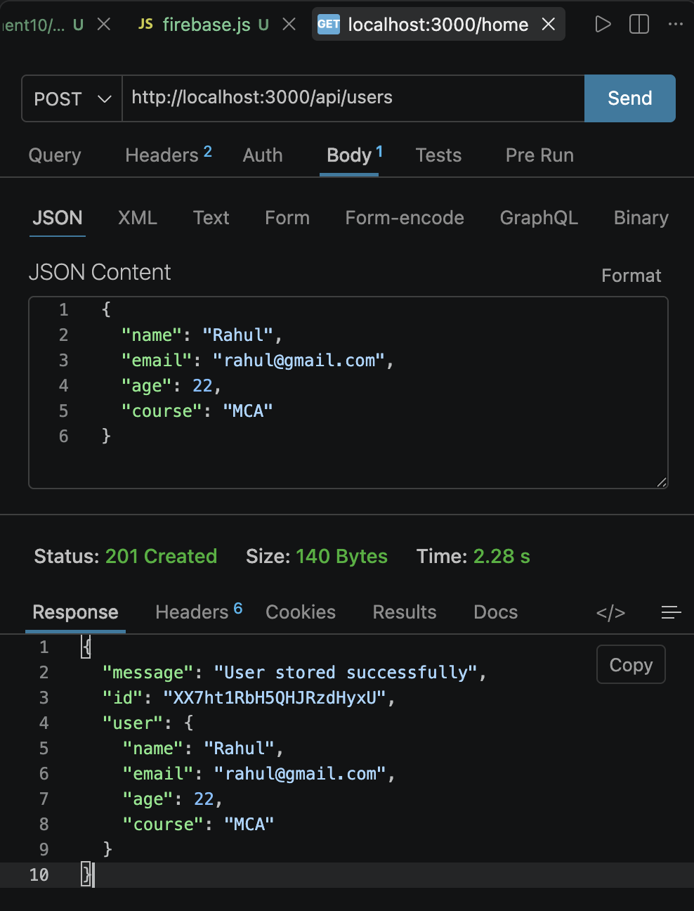
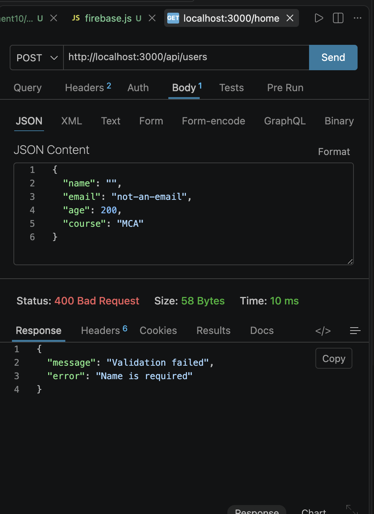

# Store Data in Firebase Firestore Using Express.js
 
## Overview
This project is an Express.js application that accepts user data through a `POST` request, validates it against a schema, and stores valid data in a Firebase Firestore collection named `users`.
 
## Folder Structure
```
project/
├── server.js
├── config/
│   └── firebase.js
├── schema/
│   └── userSchema.js
└── router/
    └── userRouter.js
```
 

 
---
 
## 1. Firebase Connection
The app connects to Firebase Firestore in `config/firebase.js` using the Firebase Admin SDK (modular API). On success, the console logs:
```
Firebase connected successfully
```
 
```javascript
const { initializeApp, cert } = require("firebase-admin/app");
const { getFirestore } = require("firebase-admin/firestore");
const serviceAccount = require("../serviceAccountKey.json");
 
initializeApp({
  credential: cert(serviceAccount),
});
 
const db = getFirestore();
 
console.log("Firebase connected successfully");
 
module.exports = db;
```
 

*Placeholder: terminal screenshot showing "Firebase connected successfully" after running `node server.js`*
 
---
 
## 2. Schema Validation
`schema/userSchema.js` uses **Joi** to validate incoming user data before it's stored:
 
| Field | Rule |
|---|---|
| `name` | Required, non-empty string |
| `email` | Required, valid email format |
| `age` | Required, number, valid range (1–120) |
| `course` | Required, non-empty string |
 
---
 
## 3. API Endpoint
 
### POST `/api/users` — Validate and Store User
 
**Request body:**
```json
{
  "name": "Rahul",
  "email": "rahul@gmail.com",
  "age": 22,
  "course": "MCA"
}
```
 
**Success response (201):**
```json
{
  "message": "User stored successfully",
  "id": "<auto-generated firestore doc id>",
  "user": {
    "name": "Rahul",
    "email": "rahul@gmail.com",
    "age": 22,
    "course": "MCA"
  }
}
```
 

*Placeholder: Postman screenshot showing POST request and 201 response*
 

 
---
 
## 4. Error Handling
 
**Validation error example — invalid/missing fields:**
```json
{
  "name": "",
  "email": "not-an-email",
  "age": 200,
  "course": "MCA"
}
```
 
**Response (400):**
```json
{
  "message": "Validation failed",
  "error": "Name is required"
}
```
 
| Scenario | Status | Response |
|---|---|---|
| Missing/invalid required field | 400 | `{ "message": "Validation failed", "error": "<field message>" }` |
| Database/server error | 500 | `{ "message": "Server error", "error": "..." }` |
 

*Placeholder: Postman screenshot showing 400 response for invalid data*
 
---
 
## 5. Tech Stack
- Node.js
- Express.js
- Firebase Admin SDK
- Firebase Firestore
- Joi (schema validation)
- Postman (API testing)
---
 
## 6. Security Note
`serviceAccountKey.json` (Firebase service account credentials) is excluded from version control via `.gitignore`:
```
node_modules/
serviceAccountKey.json
```
 
---
 
## Author
Kushal
 