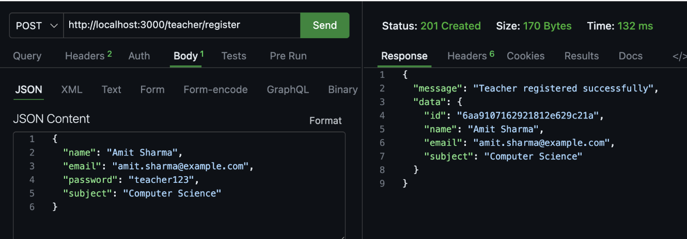
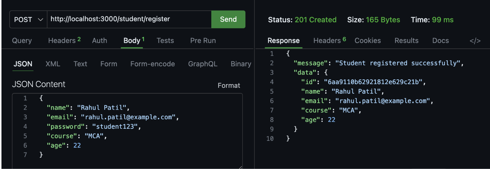
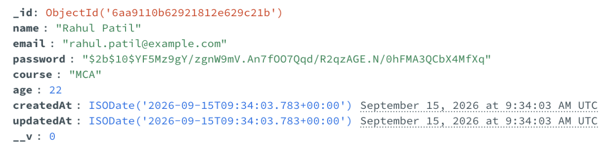

# Teacher and Student Registration – Express.js & MongoDB

A simple Express.js application that allows teachers and students to register
and store their details in a MongoDB database using Mongoose. Passwords are
hashed with bcrypt before being stored.

## Tech Stack

- **Node.js** + **Express.js** – server & routing
- **MongoDB** + **Mongoose** – database & schema modeling
- **bcrypt** – password hashing
- **nodemon** – dev server auto-restart

## Folder Structure

```
project/
├── server.js
├── package.json
├── schema/
│   ├── teacherSchema.js
│   └── studentSchema.js
├── model/
│   ├── teacherModel.js
│   └── studentModel.js
└── router/
    ├── teacherRouter.js
    └── studentRouter.js
```

## Setup Instructions

1. Clone/download the project and navigate into it:
   ```bash
   cd project
   ```

2. Install dependencies:
   ```bash
   npm install express mongoose bcrypt
   ```

3. Make sure MongoDB is running locally (`mongod`), or update the connection
   string in `server.js` to point to a MongoDB Atlas cluster.

4. Start the server:
   ```bash
   node server.js
   ```
   or, with auto-restart during development:
   ```bash
   nodemon server.js
   ```

5. The server will run at:
   ```
   http://localhost:5000
   ```

## API Endpoints

### 1. Register a Teacher

**POST** `/teacher/register`

**Request Body:**
```json
{
  "name": "John Smith",
  "email": "john.smith@example.com",
  "password": "teacher123",
  "subject": "Mathematics"
}
```

**Success Response (201):**
```json
{
  "success": true,
  "message": "Teacher registered successfully",
  "data": {
    "id": "…",
    "name": "John Smith",
    "email": "john.smith@example.com",
    "subject": "Mathematics"
  }
}
```

### 2. Register a Student

**POST** `/student/register`

**Request Body:**
```json
{
  "name": "Alice Brown",
  "email": "alice.brown@example.com",
  "password": "student123",
  "course": "MCA",
  "age": 20
}
```

**Success Response (201):**
```json
{
  "success": true,
  "message": "Student registered successfully",
  "data": {
    "id": "…",
    "name": "Alice Brown",
    "email": "alice.brown@example.com",
    "course": "MCA",
    "age": 20
  }
}
```

## Validation

- Both schemas validate required fields (`name`, `email`, `password`, etc.)
- Email must match a valid email format
- Password must be at least 6 characters
- Duplicate emails are rejected with a `409 Conflict` response
- Invalid or missing data returns a `400 Bad Request` with a descriptive message

## Password Security

All passwords are hashed using **bcrypt** (salt rounds: 10) before being saved
to MongoDB. Plain-text passwords are never stored.

## Screenshots


---

### 2. Teacher Registration – Postman Request & Response
> _Screenshot showing a successful POST request to `/teacher/register` in Postman._




---

### 3. Student Registration – Postman Request & Response
> _Screenshot showing a successful POST request to `/student/register` in Postman._

`

---

### 6. Hashed Passwords in MongoDB
> _Screenshot showing that the `password` field is stored as a bcrypt hash, not plain text._



## Author

- **Name:** _Your Name_
- **Assignment:** Teacher and Student Registration Using Express.js and MongoDB