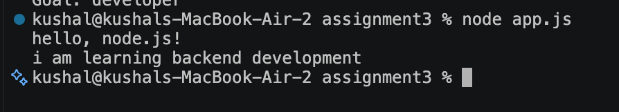
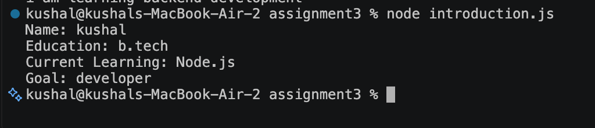

# NodeJS Basics Assignment

## Assignment Description
This assignment covers creating and executing basic Node.js applications, and using JavaScript to display output in the terminal. It includes two tasks: printing simple messages, and displaying a personal introduction.

## Project Structure
NodeJS-Basics-Assignment
│
├── app.js
├── introduction.js
└── README.md

## Task 1: Your First Node.js Program
**File:** `app.js`

**Output:**
Hello, Node.js!
I am learning backend development

## Task 2: Introduction Program
**File:** `introduction.js`

**Output:**
Name: kushal
Education: B.Tech
Current Learning: Node.js
Goal: Developer


## Steps to Run the Programs
1. Check Node.js is installed:
```bash
   node -v
```
2. Initialize the project (creates package.json):
```bash
   npm init -y
```
3. Open the project folder in VS Code / terminal.
4. Run the first program:
```bash
   node app.js
```
5. Run the second program:
```bash
   node introduction.js
```

## Commands Used
```bash
npm init -y
node app.js
node introduction.js
```

## Output Screenshots

### app.js Output


### introduction.js Output

