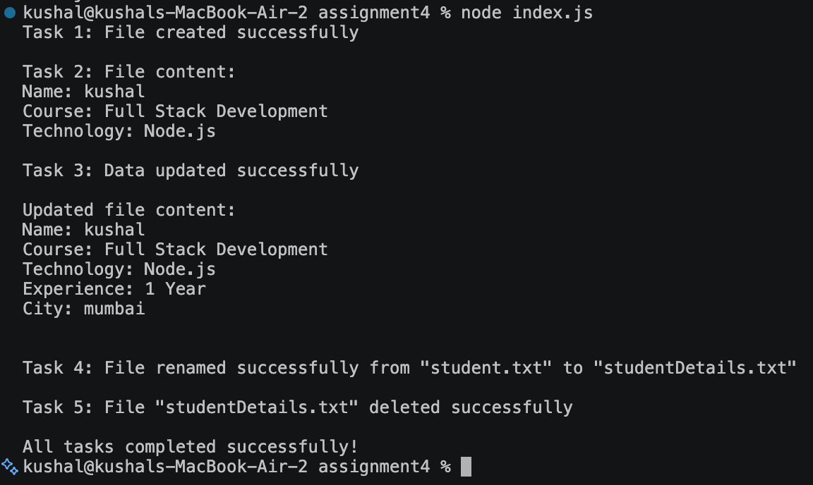

# Student File Handling Assignment (Node.js `fs` Module)

## Assignment Explanation

This project demonstrates the core file system operations in Node.js using
the built-in `fs` module. It performs the following steps in order, each
one triggered after the previous completes:

1. **Create** — `fs.writeFile()` creates `student.txt` and writes basic
   student details (Name, Course, Technology).
2. **Read** — `fs.readFile()` reads `student.txt` and prints its contents
   to the terminal, with error handling.
3. **Update** — `fs.appendFile()` adds more information (Experience, City)
   to `student.txt` **without deleting** the existing content.
4. **Rename** — `fs.rename()` renames `student.txt` to `studentDetails.txt`
   and logs a confirmation message.
5. **Delete** — `fs.unlink()` removes `studentDetails.txt` once all
   operations are complete.

Because `fs` methods here are asynchronous (callback-based), each task is
wrapped in its own function and the next task is called inside the
previous task's callback. This guarantees the operations run in the
correct order (create → read → update → rename → delete) instead of
running all at once.

## Project Structure

```
Project Folder
│
├── index.js
├── student.txt        (created and deleted at runtime — see note below)
├── package.json
└── README.md
```

> **Note:** `student.txt` is generated by the program when it runs, and is
> deleted (after being renamed) by the final step. It won't exist in the
> folder before you run the program, and it won't exist after the program
> finishes either — that's expected behavior per Task 5.

## How to Run

1. Make sure [Node.js](https://nodejs.org) is installed:
   ```bash
   node -v
   ```
2. Open a terminal in the project folder.
3. Run the program:
   ```bash
   node index.js
   ```
   or, using the npm script:
   ```bash
   npm start
   ```
4. Watch the terminal output — it will show each task's result in order
   (file created, file content, updated content, rename confirmation,
   delete confirmation).

## Output Screenshots

## Error Handling

Every `fs` operation checks for an `err` object in its callback. If an
error occurs (e.g., file not found, permission denied), the program logs
a descriptive error message via `console.error()` and stops that
operation instead of crashing silently.
