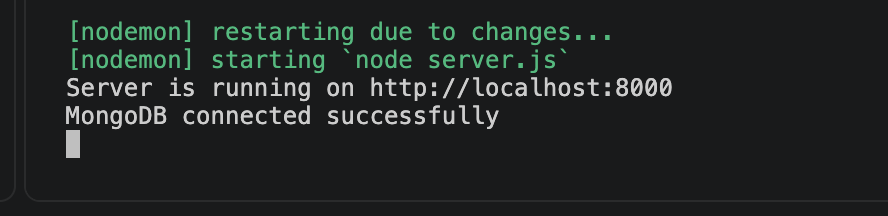
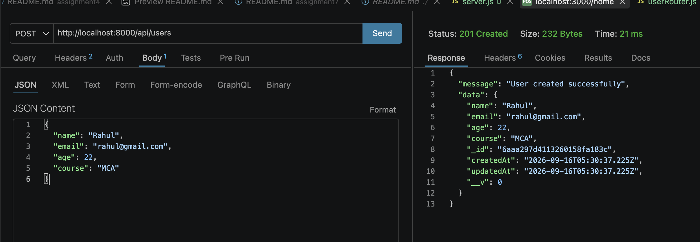
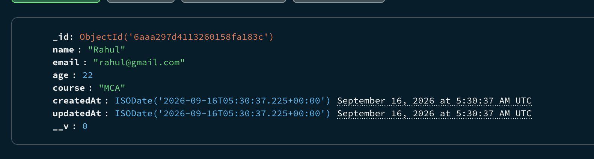
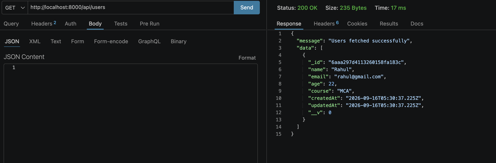

# Assignment 8 – Create and Retrieve Users (Express, MongoDB, Mongoose)

## 📌 Problem Statement
An Express.js application that connects to a MongoDB database using Mongoose. The application allows adding new user data to MongoDB and retrieving user data from MongoDB, with schema, model, and routing logic separated into their own files.

## 🛠️ Tech Stack
- Node.js
- Express.js
- MongoDB
- Mongoose

## 📂 Folder Structure
```
assignment8/
│
├── server.js
├── schema/
│   └── userSchema.js
├── model/
│   └── userModel.js
├── router/
│   └── userRouter.js
├── screenshots/
└── README.md
```

## ⚙️ Setup & Installation

1. Clone or download this repository.
2. Install dependencies:
   ```bash
   npm install express mongoose
   ```
3. Make sure MongoDB is running locally (or update the connection string in `server.js` to your MongoDB Atlas URI).
4. Start the server:
   ```bash
   nodemon server.js
   ```
5. Server runs at:
   ```
   http://localhost:5000
   ```

## 🔌 MongoDB Connection
The app connects to MongoDB using Mongoose in `server.js`. On success, the terminal displays:
```
MongoDB connected successfully
```
On failure, an appropriate error message is logged instead.

## 📋 API Endpoints

### 1. Create User
**POST** `/api/users`

Request Body:
```json
{
  "name": "Rahul",
  "email": "rahul@gmail.com",
  "age": 22,
  "course": "MCA"
}
```

Response:
```json
{
  "message": "User created successfully",
  "data": { ... }
}
```

### 2. Get All Users
**GET** `/api/users`

Response:
```json
{
  "message": "Users fetched successfully",
  "data": [ ... ]
}
```

## 🖼️ Screenshots

All screenshots are available in the `screenshots/` folder.

### 1. MongoDB Connected Successfully
Terminal output confirming a successful database connection.



### 2. Successful POST Request
Thunder Client / Postman request adding a new user.



### 3. Data Stored in MongoDB
Data visible in MongoDB Compass / `mongosh` confirming the record was saved.



### 4. Successful GET Request
Thunder Client / Postman request retrieving all users.



## 📝 Notes
- Schema, model, and router logic are kept in separate files as required — none of this logic is defined directly in `server.js`.
- Port `5000` was used; on macOS, ensure **AirPlay Receiver** is disabled or use an alternate port (e.g. `8000`) if you get an unexpected `403 Forbidden` response, since AirPlay Receiver also listens on port 5000 by default.

## ✅ Author
Kushal