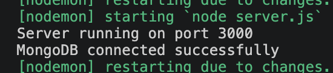
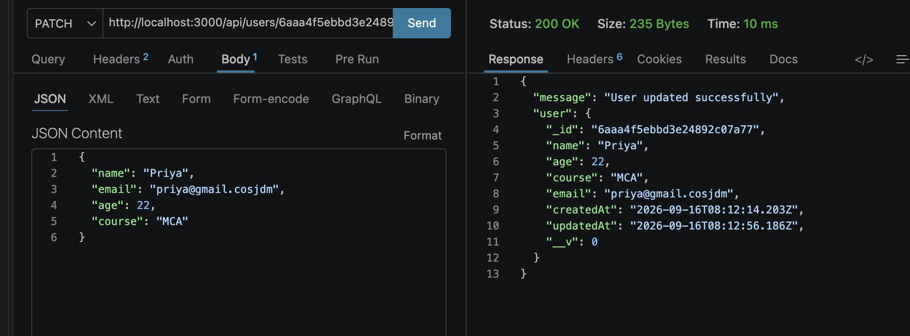
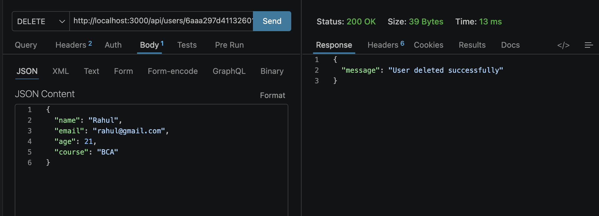

# Question 2: Update and Delete Users — Express, MongoDB & Mongoose
 
## Overview
This project extends the Question 1 application to support **updating** and **deleting** existing users using Mongoose models, following proper folder structure (schema / model / router separated from `server.js`).
 
## Folder Structure
```
project/
│
├── server.js
│
├── schema/
│   └── userSchema.js
│
├── model/
│   └── userModel.js
│
└── router/
    └── userRouter.js
```
 

 
---
 
## 1. MongoDB Connection
The app connects to MongoDB using Mongoose in `server.js`. On success, the console logs:
```
MongoDB connected successfully
```
 

*Placeholder: terminal screenshot showing "MongoDB connected successfully" after running `node server.js`*
 
---
 
## 2. Schema & Model
- `schema/userSchema.js` defines the Mongoose schema (`name`, `email`, `age`, `course`).
- `model/userModel.js` compiles the schema into the `User` model.
- The router only imports `User` from `model/userModel.js` — schema/model are never redefined elsewhere.
---
 
## 3. API Endpoints
 
### POST `/api/users` — Create User
Creates a new user document.
 
**Request body:**
```json
{
  "name": "Priya",
  "email": "priya@gmail.com",
  "age": 22,
  "course": "MCA"
}
```
 
**Success response (201):**
```json
{
  "message": "User created successfully",
  "user": { "_id": "...", "name": "Priya", "email": "priya@gmail.com", "age": 22, "course": "MCA" }
}
```
 

*Placeholder: Postman screenshot showing POST request and 201 response*
 
---
 
### PATCH `/api/users/:id` — Update User
Updates an existing user by MongoDB `_id`.
 
**Request:**
```
PATCH /api/users/<user_id>
```
```json
{
  "age": 23,
  "course": "MCA - Data Science"
}
```
 
**Success response (200):**
```json
{
  "message": "User updated successfully",
  "user": { "_id": "...", "age": 23, "course": "MCA - Data Science", ... }
}
```
 

*Placeholder: Postman screenshot showing PATCH request and 200 response*
 
 
---
 
### DELETE `/api/users/:id` — Delete User
Deletes a user by MongoDB `_id`.
 
**Request:**
```
DELETE /api/users/<user_id>
```
 
**Success response (200):**
```json
{ "message": "User deleted successfully" }
```
 

*Placeholder: Postman screenshot showing DELETE request and 200 response*

 
---
 
## 4. Error Handling
 
| Scenario | Status | Response |
|---|---|---|
| Invalid MongoDB ID format | 400 | `{ "message": "Invalid user ID" }` |
| Valid ID format, user not found | 404 | `{ "message": "User not found" }` |
| Database/server error | 500 | `{ "message": "Server error", "error": "..." }` |
| Missing required fields (POST) | 400 | `{ "message": "All fields are required" }` |
 

 
 
---
 
## 5. Tech Stack
- Node.js
- Express.js
- MongoDB
- Mongoose
- Postman (for API testing)
- MongoDB Compass (for verifying database state)
---
 
## Author
Kushal